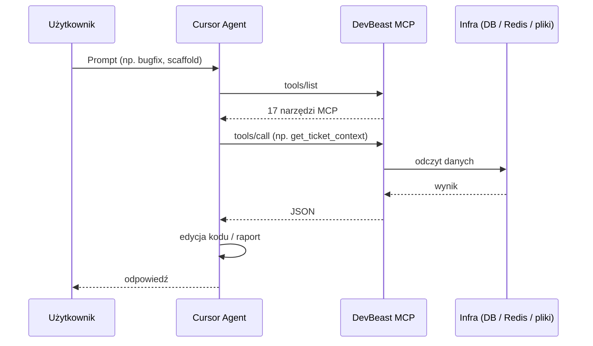

# Jak to działa

Ten dokument opisuje **mechanikę DevBeast MCP** — co się dzieje od momentu wpisania polecenia w chacie Cursor, aż po odpowiedź agenta z realnymi danymi z bazy, logów lub repo.


## Ogólny flow



1. **Cursor** uruchamia proces `dotnet run --project DevBeast.Mcp.Server` jako serwer MCP (konfiguracja w `mcp.json`).
2. Agent widzi **17 narzędzi** (np. `get_database_schema`, `ensure_project_structure`, `get_tool_call_stats`).
3. Gdy potrzebuje danych, wywołuje narzędzie — serwer wykonuje logikę i zwraca **JSON**.
4. Agent na podstawie JSON generuje kod, migracje, poprawki lub raport.

Komunikacja odbywa się po **stdio** — stdout to wyłącznie protokół MCP, logi serwera idą na stderr.

## Manifest projektu (`.devbeast/project-structure.json`)

Kluczowy element integracji z repo docelowym. Narzędzie `ensure_project_structure`:

1. Szuka manifestu w katalogu projektu.
2. Jeśli brak — skanuje `*.csproj` i wykrywa warstwy (Domain, Application, Api…).
3. Jeśli struktura niekompletna — **generuje szkielet** Clean Architecture.
4. Zapisuje manifest do repo (commitowalny plik).

Inne narzędzia (np. `scaffold_feature_slice`, `validate_architecture_rules`) korzystają ze ścieżek z manifestu zamiast zgadywać layout projektu.

Przykład manifestu (`samples/ReferenceApp/.devbeast/project-structure.json`):

```json
{
  "namespacePrefix": "App",
  "layers": {
    "Domain":       { "path": "src/App.Domain",       "project": "src/App.Domain/App.Domain.csproj" },
    "Application":  { "path": "src/App.Application",  "features": ["Orders", "Products"] },
    "Infrastructure": { "path": "src/App.Infrastructure", ... },
    "Api":          { "path": "src/App.Api", ... },
    "Tests":        { "path": "tests/App.Application.Tests", ... }
  }
}
```

## Typowe scenariusze


### Scenariusz 1: Bug z Jiry → fix w kodzie

```
Użytkownik: Pobierz ticket PROJ-142 i napraw NullReferenceException
```

| Krok | Narzędzie MCP | Co robi |
|------|---------------|---------|
| 1 | `get_ticket_context` | Czyta mock `Mocks/tickets/PROJ-142.json` — opis buga, AC, linked files |
| 2 | `ensure_project_structure` | Upewnia się, że zna layout projektu |
| 3 | `validate_architecture_rules` | (opcjonalnie) Sprawdza reguły Clean Architecture |
| 4 | Agent | Edytuje kod w plikach wskazanych w tickecie |
| 5 | `create_pull_request_with_impact` | Mock PR z analizą ryzyka |

### Scenariusz 2: Nowy feature (Vertical Slice)

```
Użytkownik: Zscaffolduj feature Payment w samples/Scaffolded
```

| Krok | Narzędzie | Co robi |
|------|-----------|---------|
| 1 | `ensure_project_structure` | Generuje/odczytuje strukturę w target path |
| 2 | `scaffold_feature_slice` | Tworzy Entity, CQRS, Controller, Migration, testy — ścieżki z manifestu |

### Scenariusz 3: Diagnostyka produkcji

```
Użytkownik: Pokaż pending orders z MongoDB i błędy z ostatnich 15 minut
```

| Krok | Narzędzie | Co robi |
|------|-----------|---------|
| 1 | `get_database_schema` | Schemat kolekcji `orders` |
| 2 | `execute_read_query` | `{"collection":"orders","filter":{"status":"Pending"},"limit":10}` |
| 3 | `get_recent_errors` | Agregacja wyjątków z plików logów |

### Scenariusz 4: Security audit

```
Użytkownik: Przeskanuj ReferenceApp pod kątem secretów i CVE w NuGet
```

| Krok | Narzędzie | Co robi |
|------|-----------|---------|
| 1 | `scan_secrets_and_pii` | Regex: API keys, JWT, hasła, PESEL, emaile |
| 2 | `check_nuget_vulnerabilities` | `dotnet list package --vulnerable` |

## Tryby pracy

### Mock vs live

| Integracja | Domyślnie | Źródło danych |
|------------|-----------|---------------|
| Jira / ADO | **Mock** | `Mocks/tickets/*.json` |
| GitHub PR | **Mock** | `MockPullRequestService` — symulowany URL + impact |
| MongoDB | **Live** (Docker) | `localhost:27018` |
| Redis | **Live** z fallback | Docker `:6379` → mock store gdy niedostępny |
| DLQ | **Live + fallback** | Kolekcja MongoDB `deadLetterMessages` |
| Logi | **Pliki** | Katalog z `appsettings` |

### Provider bazy danych

Przełączany w konfiguracji (`DevBeast:Database:Provider`):

- **`MongoDB`** — `execute_read_query` przyjmuje JSON find (np. `{"collection":"products","filter":{},"limit":10}`)
- **`SqlServer`** — `execute_read_query` przyjmuje SQL SELECT (blokada INSERT/UPDATE/DELETE)

## Bezpieczeństwo zapytań

- **SQL:** tylko SELECT/WITH — walidacja w `SqlQueryValidator`
- **MongoDB:** tylko operacje read (find przez JSON)
- **Secrets scan:** wykrywa wrażliwe dane w kodzie, ale nie wysyła ich na zewnątrz
- **Konfiguracja:** `appsettings.Local.json` jest w `.gitignore`

## Co agent „widzi” vs co robi sam

| Agent robi sam (Edytor) | DevBeast MCP robi za agenta |
|-------------------------|----------------------------|
| Edycja plików `.cs` | Odczyt schematu DB / logów |
| Uruchamianie `dotnet test` | Walidacja architektury całego drzewa |
| Commit / push | Generowanie vertical slice (wiele plików naraz) |
| | Mock ticket → PR flow z impact analysis |
| | Diff appsettings Dev/Test/Prod |

## Kolejność narzędzi (best practice)

```mermaid
flowchart TD
    subgraph nowy["Nowy projekt"]
        A1[ensure_project_structure] --> A2[scaffold_feature_slice]
        A2 --> A3[validate_architecture_rules]
    end
    subgraph bug["Bugfix z ticketa"]
        B1[get_ticket_context] --> B2[ensure_project_structure]
        B2 --> B3[agent fixuje kod]
        B3 --> B4[create_pull_request_with_impact]
    end
    subgraph debug["Debug runtime"]
        D1[get_recent_errors] --> D2[peek_dead_letter_queue]
        D2 --> D3[inspect_redis_cache]
    end
```



## Gotowe prompty (copy-paste)

Pełna lista **20 scenariuszy** z promptami do wklejenia w Cursor Agent → [AGENT_WORKFLOWS.md](AGENT_WORKFLOWS.md).

Przykłady: bugfix z Jiry, vertical slice z ADO, diagnostyka incydentu, security audit, on-call runbook.

## Dalsze reading

- [AGENT_WORKFLOWS.md](AGENT_WORKFLOWS.md) — gotowe prompty pod scenariusze
- [SETUP.md](SETUP.md) — instalacja krok po kroku
- [ARCHITECTURE.md](ARCHITECTURE.md) — warstwy kodu serwera
- [TOOLS.md](TOOLS.md) — pełna referencja parametrów
