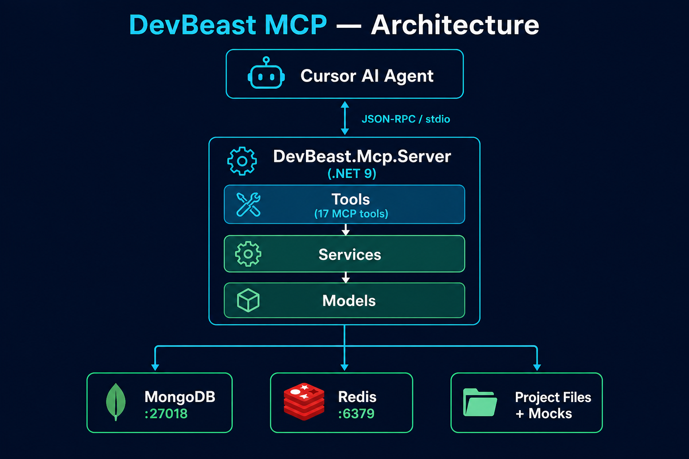
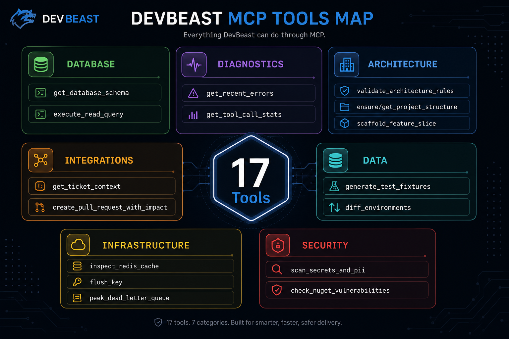
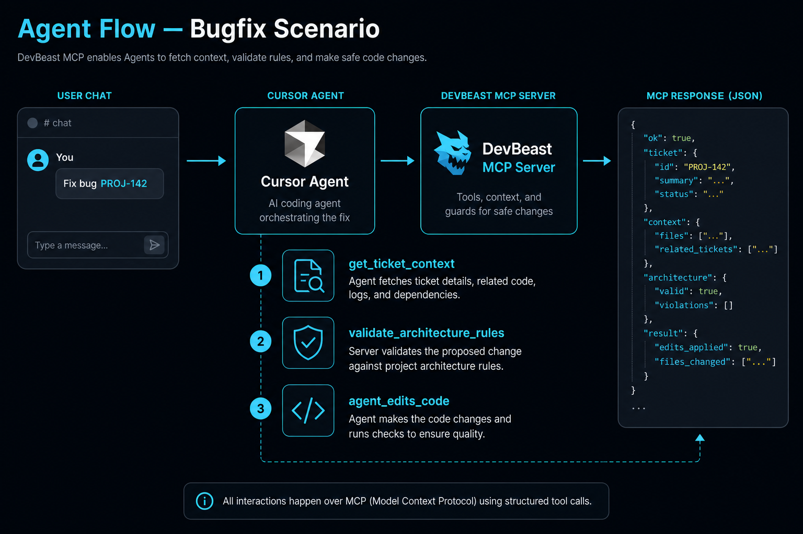
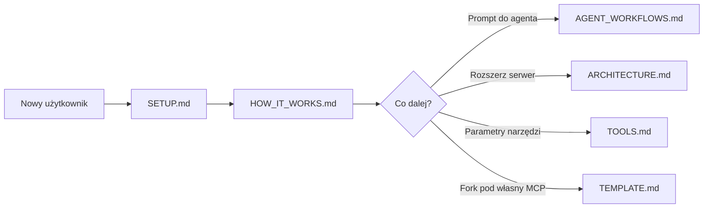

# Dokumentacja DevBeast MCP

Lokalny serwer MCP w .NET 9 — **17 narzędzi** dla agentów AI (Cursor, Claude Desktop, Claude Code).

## Szybka nawigacja

| | Dokument | Opis |
|---|----------|------|
| 🏠 | [README.md](../README.md) | Strona główna repo, szybki start |
| ⚙️ | [HOW_IT_WORKS.md](HOW_IT_WORKS.md) | Flow agenta, transport MCP, manifest, scenariusze |
| 🤖 | [AGENT_WORKFLOWS.md](AGENT_WORKFLOWS.md) | **20 gotowych promptów** — copy-paste do Cursor Agent |
| 👥 | [AGENTS.md](../AGENTS.md) | Orkiestrator + Architect / Coder / Tester |
| 🛠 | [SETUP.md](SETUP.md) | Docker, config, Cursor MCP, troubleshooting |
| 🏗 | [ARCHITECTURE.md](ARCHITECTURE.md) | Warstwy serwera, serwisy, rozszerzalność |
| 📋 | [TOOLS.md](TOOLS.md) | Referencja 17 narzędzi MCP z parametrami |
| 📦 | [TEMPLATE.md](TEMPLATE.md) | Repo jako starter kit pod własny serwer MCP |

## Wizualne przewodniki

### Instalacja (5 kroków)

Szczegóły → [SETUP.md](SETUP.md)

### Mapa narzędzi MCP

Pełna referencja → [TOOLS.md](TOOLS.md)

### Flow agenta (przykład: bugfix)

Więcej scenariuszy → [HOW_IT_WORKS.md](HOW_IT_WORKS.md) · [AGENT_WORKFLOWS.md](AGENT_WORKFLOWS.md)

### Pipeline zespołu agentów

Szczegóły ról → [AGENTS.md](../AGENTS.md)

## Ścieżki czytania

| Cel | Zacznij od | Potem |
|-----|------------|-------|
| Uruchomić DevBeast w Cursor | [SETUP.md](SETUP.md) | [AGENT_WORKFLOWS.md](AGENT_WORKFLOWS.md) § Szybki start |
| Zrozumieć mechanikę MCP | [HOW_IT_WORKS.md](HOW_IT_WORKS.md) | [ARCHITECTURE.md](ARCHITECTURE.md) |
| Dodać własne narzędzie | [ARCHITECTURE.md](ARCHITECTURE.md) § Rozszerzalność | [TOOLS.md](TOOLS.md) |
| Sklonować jako template | [TEMPLATE.md](TEMPLATE.md) | [SETUP.md](SETUP.md) |
| Praca wieloagentowa | [AGENTS.md](../AGENTS.md) | `.agents/` w repo |

## Grafiki w repo

Pliki w [`docs/assets/`](assets/):

| Plik | Zastosowanie |
|------|--------------|
| `devbeast-architecture.png` | Diagram komponentów |
| `devbeast-setup.png` | Checklist instalacji |
| `devbeast-tools-map.png` | Mapa 17 narzędzi |
| `devbeast-agent-flow.png` | Scenariusz bugfix |
| `devbeast-agent-pipeline.png` | Pipeline Architect → Coder → Tester |

> **Zrzuty ekranu Cursor:** możesz uzupełnić docs o realne screenshoty (Settings → MCP, Agent chat z wywołaniami narzędzi). Wstaw je do `docs/assets/screenshots/` i dodaj w [SETUP.md](SETUP.md).
